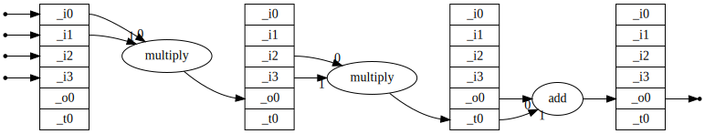

The package ``chain_ufunc`` allows one to create chains of ufuncs,
which are executed in order.  The idea is to do this at the C level,
executing the inner loops in order on nicely sized pieces, so that one
avoids allocating possibly large arrays for the intermediate steps,
saving memory and speeding up execution (for large arrays).  There is
also a python version for comparison.

.. note:: This is far from complete! For instance, all inputs and
          outputs of the ufuncs that are combined have to be
          ``float64`` at present.  And there is no documentation
          beyond the docstrings (and this file).

Example:

  >>> import numpy as np
  >>> from chain_ufunc import create_chained_ufunc
  >>> muladd = create_chained_ufunc([(np.multiply, [0, 1, 3]), (np.add, [2, 3, 3])], 3, 1, 0, "muladd")
  >>> muladd([0., 2., 1.], [4., 1., 6.], 0.1)
  array([0.1, 2.1, 6.1])

There is preliminary support for generating the ufunc automatically,
by passing in a special ``Input`` instance.

Example:

  >>> import numpy as np
  >>> from chain_ufunc import Input
  >>> def fun(a, b, c, d):
  ...     return a*b + c*d
  >>> ufunc = fun(Input(), Input(), Input(), Input())
  >>> ufunc.links
  [(<ufunc 'multiply'>, [0, 1, 4]),
   (<ufunc 'multiply'>, [2, 3, 5]),
   (<ufunc 'add'>, [4, 5, 4])]
  >>> ufunc.graph()  # doctest: +SKIP
  <graphviz.graphs.Digraph object at ...>

On an jupyter notebook with ``graphviz`` installed, the latter gives a
nice image:

Comparing speed between the regular numpy function and the ufunc:

  >>> a = np.random.normal(size=1000000)
  >>> b = np.random.normal(size=1000000)
  >>> np.all(fun(2., a, b, 10.) == ufunc(2., a, b, 10.))
  True
  >>> %timeit fun(2., a, b, 10.)  # doctest: +SKIP
  5.91 ms ± 33.8 µs per loop (mean ± std. dev. of 7 runs, 100 loops each)
  >>> %timeit ufunc(2., a, b, 10.)  # doctest: +SKIP
  1.76 ms ± 3.65 µs per loop (mean ± std. dev. of 7 runs, 1,000 loops each)

The latter speed-up is comparable to what one gains with ``numexpr``.
